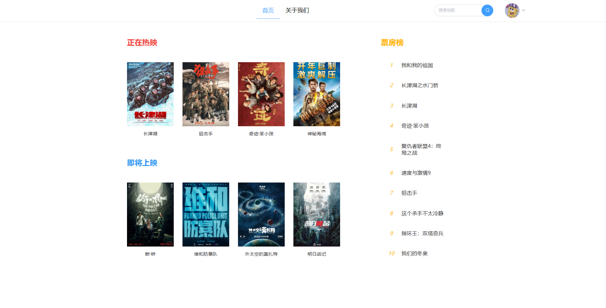
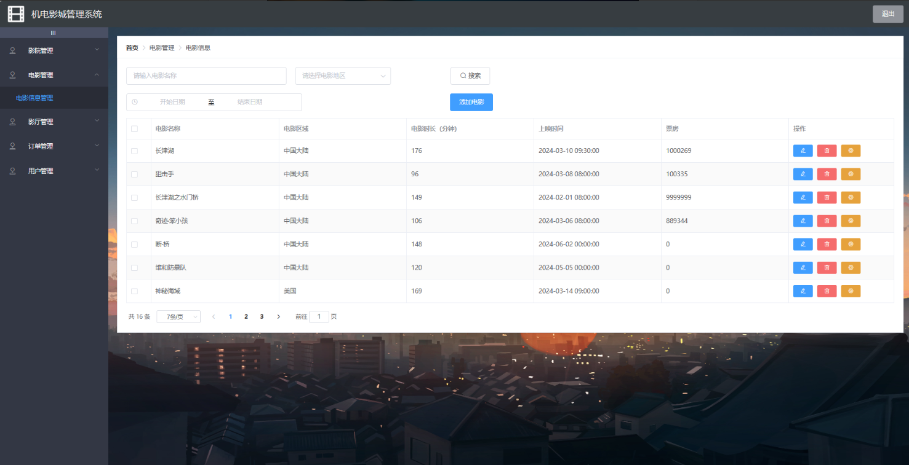

# 电影院购票管理系统

### 9.9￥ 获取完整源码+sql，需要加Q：3577148218 ,微信: qszard26
### 有问题，或者需要协助调试运行项目的也可联系
### 更多项目： https://github.com/34426?tab=repositories

## 一、介绍

基于springboot+vue的前后端电影售票系统

用户功能

登录、退出、注册
修改个人信息、
上映|即将上映|热播影片浏览、搜索
上映|即将上映|热播榜单浏览
选座购票
订单查看

管理员功能

影院信息管理
影片管理：电影信息、电影类型
影厅管理：影厅信息、场次信息管理
订单管理
用户管理
角色权限管理：角色信息管理、权限信息管理

## 二、软件架构

语言：java

前端技术：Vue、 ELementUI

后端技术：SpringBoot、Mybatis-Plus

数据库：MySQL

## 三、系统部分功能页面展示

### 9.9￥ 获取完整源码+sql，需要加Q：3577148218 ,微信: qszard26
### 有问题，或者需要协助调试运行项目的也可联系

